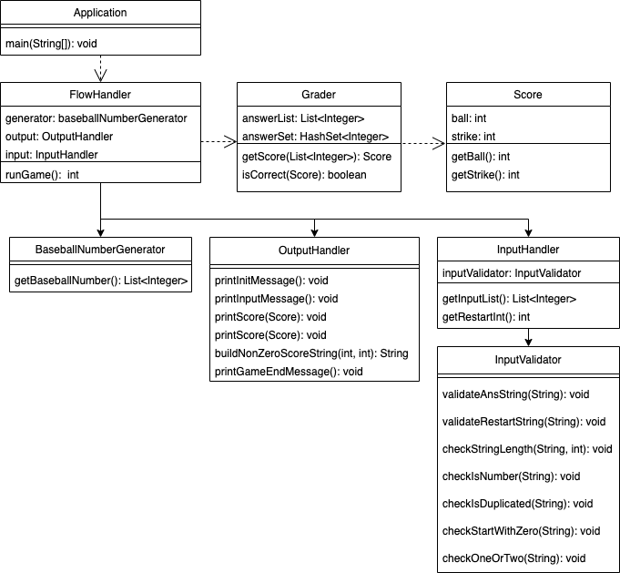

# 미션 - 숫자 야구

## 클래스 다이어그램

클래스 간 Association, Dependency 관계를 표현한 그림은 아래와 같다.

## 구현 기능 목록

- [X] Application 클래스: 재시작 입력값에 따라 무한히 runGame 메서드 호출

- [X] FlowHandler 클래스:
    - [X] int runGame() 메서드: 입출력 및 점수계산 등의 게임 흐름 관리

- [X] Score 클래스: 볼, 스트라이크 횟수를 보관하는 DTO

- [X] BaseballNumGenerator 클래스:
    - [X] List<Integer> getBaseballNumber() 메서드: 세 개의 난수가 담긴 리스트 반환

- [X] Grader 클래스:
    - [X] Score getScore(List<Integer>) 메서드
    - [X] boolean isCorrect(List<Integer>) 메서드

- [X] OutputHandler 클래스:
    - [X] void printInitMessage() 메서드
    - [X] void printInputMessage() 메서드
    - [X] void printScore(Score) 메서드
        - [X] String buildNonZeroScoreString(int, int) 메서드: '낫싱'이 아닐 경우에 점수를 문자열로 생성
    - [X] void printGameEndMessage() 메서드

- [X] InputHandler 클래스:
    - [X] List<Integer> getInputList() 메서드: 콘솔 입력값을 validation도 진행
    - [X] int getRestartInt() 메서드: validation도 진행

- [X] InputValidator 클래스: IllegalArgumentException 상황들 처리
    - [X] boolean validateAnsString(String) 메서드
        - [X] 길이가 3이 아닌 입력 검증
        - [X] 숫자가 아닌 입력 검증
        - [X] 동일한 숫자가 포함되었는지 검증
        - [X] 맨 앞자리가 0이 아닌지 검증
    - [X] boolean validateRestartString(String) 메서드
        - [X] 입력이 문자열 1또는 2인지 검증
